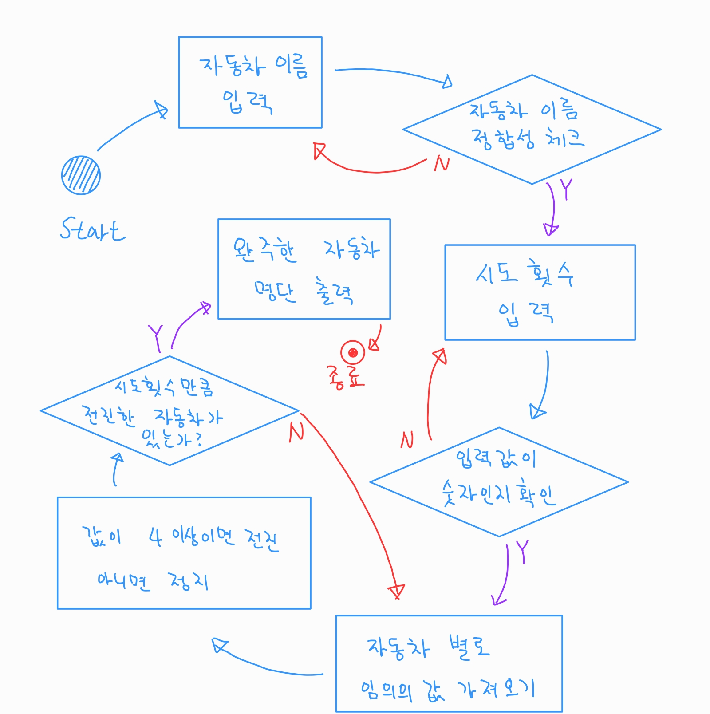

# 자동차 경주 게임

## 1. 프로세스

## 2. 기능 목록

|No|기능 정의|비고|
|:---:|:---|:---|
|1|자동차 이름 입력|
|2|자동차 이름이 5자 이하인지 체크|
|3|시도횟수 입력|
|4|시도횟수가 숫자인지 체크|
|5|자동차 객체 생성|
|6|임의의 숫자를 가져와 전진할 것인지 체크|
|7|자동차 별 전진한 수 출력|
|8|자동차 전진횟수 중 시도횟수와 일치하는 값이 있는지 확인|없으면 5번 기능부터 다시 시작|
|9|일치하는 값이 있으면 시도횟수에 도달한 자동차 명단 출력 후 게임 종료|